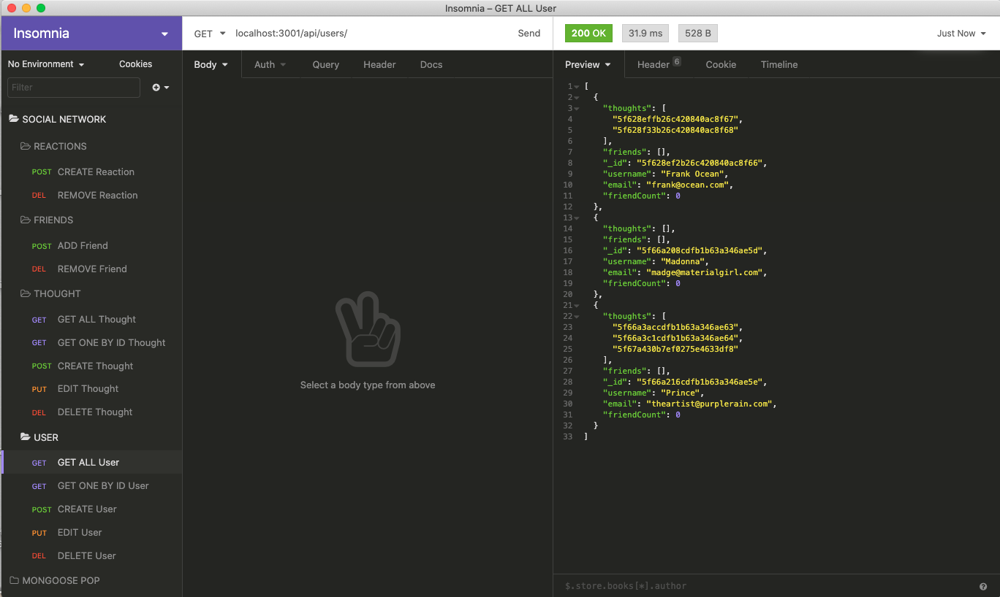

# Social Network API 

[](https://youtu.be/7R0tcfcdmg8)

[Link to walkthrough video on YouTube](https://youtu.be/7R0tcfcdmg8)

## Description

Welcome to the NoSQL Social Network API challenge for week 18 of Coding Boot Camp through UCLA Extension. This week's challenge was to build an API for a social network web application using Express.js for routing, a MongoDB database, the Mongoose ODM and Moment.js to format time. The API uses a NoSQL database to handle large amounts of unstructured data.

## Usage

Clone or fork this repo if you would like. 

Install dependencies by running the following: 

```
npm i
```

Then you will need to start the application's server by typing the following on the command line:

```
npm start
```

## License

This application is covered under the MIT license.

## Contributing

Submit a pull request if you would like to contribute.

## Questions
Feel free to email me at seandoesitbetter@gmail.com with any questions.

Check out my GitHub profile: [seanc0ne](https://www.github.com/seanc0ne)
